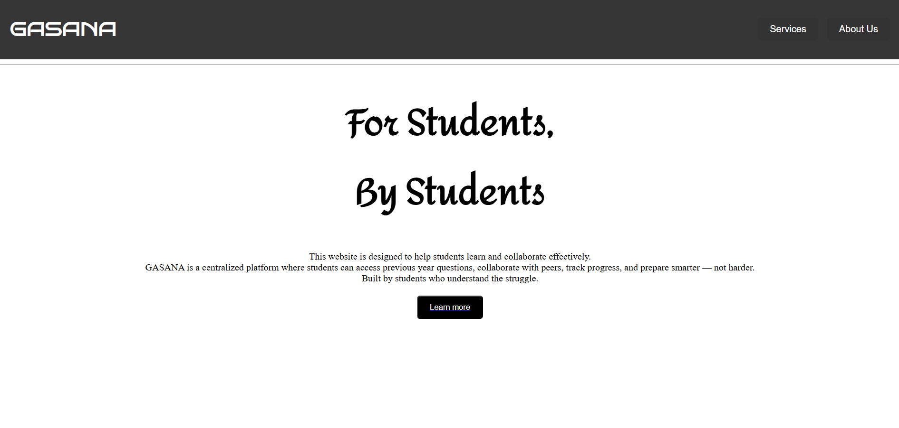

# GASANA

A centralized student platform built using Flask.
Built as a student-led learning platform project.

## Project Name

**GASANA** is inspired by the Hindi word _"Khazana"_, meaning _Treasure_ — symbolizing a valuable collection of knowledge for students.

The project was developed by team **AXIOM**:
Gitto, Alen, Sreedurga, Archa, Neeraja.

## Features

- Previous Year Questions
- Study Notes
- Important Questions
- Exam Simulator
- Doubt Clearance
- Stress Support System

## Tech Stack

- Frontend: HTML, CSS
- Backend: Python, Flask
- Database: SQLite
- PDF Processing: PyPDF2
- Version Control: Git, GitHub
- Environment: venv, pip
- API: Hugging Face API

## How to Run

1. Clone the repository
2. Install dependencies
3. Run web.py

## Future Enhancements

- Improved AI evaluation accuracy
- Better UI/UX design
- Performance optimization
- Personalised dashboard
